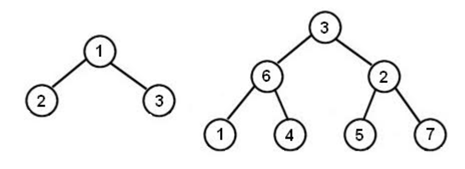
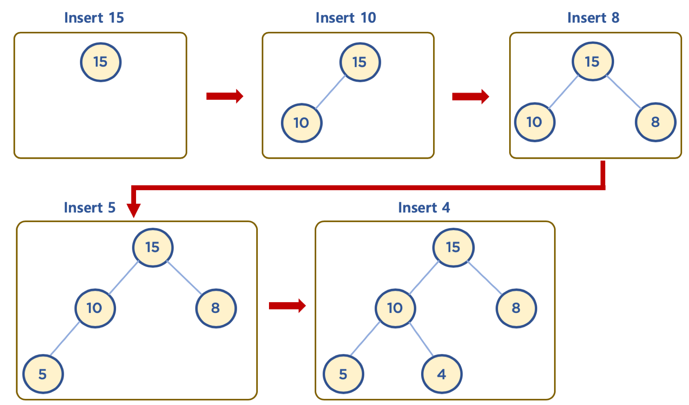
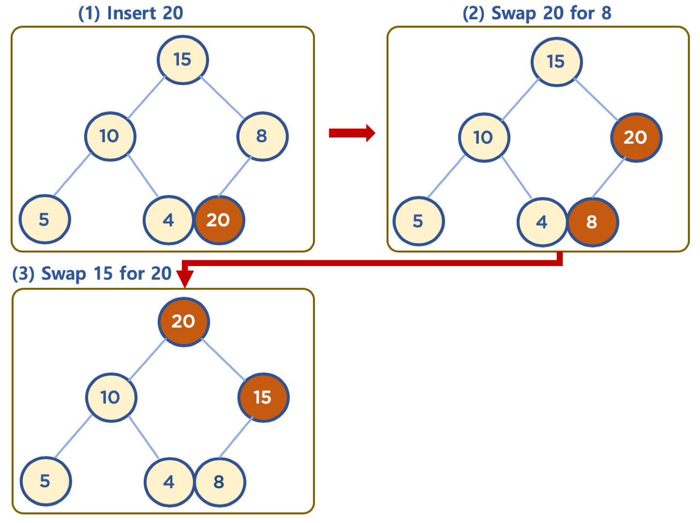
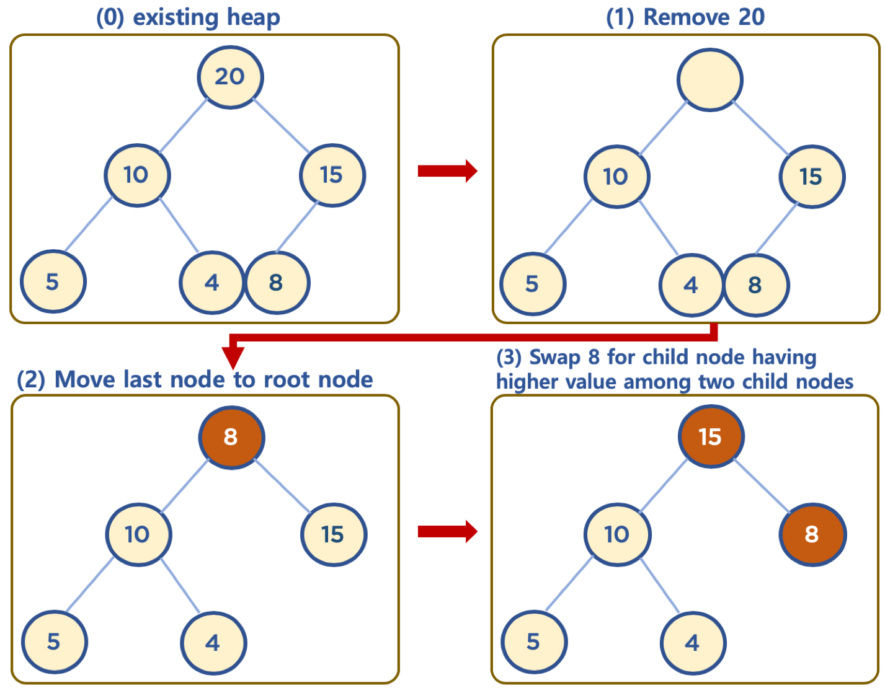
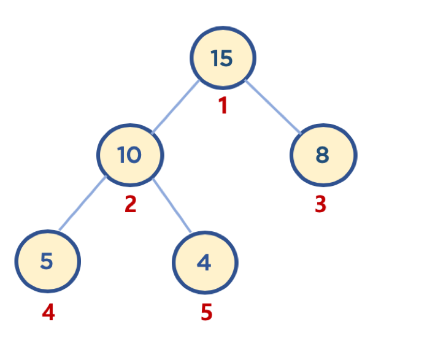

# 힙 \( Heap \)

## 1. 힙 \( Heap \)이란?

* 힙: 데이터에서 최대값과 최소값을 빠르게 찾기 위해 고안된 완전 이진 트리\( Complete Binary Tree \)
  * 완전 이진 트리 : 노드를 삽입할 때 최하단 왼쪽 노드부터 차례대로 삽입하는 트리



* 힙을 사용하는 이유
  * 배열에 데이터를 넣고, 최댓값과 최솟값을 찾으려면 O\(n\)이 걸린다.
  * 이에 반해, 힙에 데이터를 넣고, 최댓값과 최솟값을 찾으면 O\(log n\)이 걸린다.
  * 우선순위 큐와 같이 최댓값 또는 최솟값을 빠르게 찾아야 하는 자료구조 및 알고리즘 구현 등에 활용된다.


## 2. 구조

* 힙은 최댓값을 구하기 위한 구조\( 최대힙, Max Heap \)와 최솟값을 구하기 위한 구조\( 최소힙, Min Heap \)로 분류될 수 있다.
* 힙은 다음과 같이 두 가지 조건을 가지고 있는 자료구조이다.
  * 각 노드의 값은 해당 노드의 자식 노드가 가진 값보다 크거나 같다.\( 최대힙 \)
    * 최소힙의 경우는 각 노드의 값은 해당 노드의 자식 노드가 가진 값보다 크거나 작다. 
  * 완전 이진 트리 형태를 가진다.

#### 힙과 이진 탐색 트리의 공통점과 차이점

* 공통점
  * 힙과 이진 탐색 트리는 모두 이진 트리이다. 
* 차이점
  * 힙은 각 노드의 값이 자식 노드보다 크거나 같다.\( Max Heap \)
  * 이진 탐색 트리는 왼쪽 자식 노드의 값이 가장 작고, 그 다음 부모 노드, 그 다음 오른쪽 자식 노드 값이 가장 크다.
  * 힙은 이진 탐색 트리의 조건인 자식 노드에서 작은 값은 왼쪽, 큰 값은 오른쪽이라는 조건이 없다.
    * 힙의 왼쪽 및 오른쪽 자식 노드의 값은 오른쪽이 클 수도 있고, 왼쪽이 클 수도 있다. 
* 이진 탐색 트리는 탐색을 위한 구조, 힙은 최대/최솟값 검색을 위한 구조 중 하나로 이해하면 쉽다.


## 3. 동작

#### 데이터 삽입 \( 기 \)

* 힙은 완전 이진 트리이므로 삽입할 노드는 기본적으로 왼쪽 최하단부 노드부터 채워지는 형태로 삽입된다.




#### 데이터 삽입 \( 삽입할 데이터가 힙의 데이터보다 클 경우\( Max Heap \) \)

* 먼저 삽입된 데이터는 완전 이진 트리 구조에 맞춰 최하단부 왼쪽 노드부터 채워져 있다.
* 채워진 노드 위치에서, 부모 노드보다 값이 클 경우, 부모 노드와 위치를 바꿔주는 작업을 반복한다.\( swap \)




#### 데이터 삭제 \( Max Heap \)

* 보통 삭제는 최상단 노드\( Root Node \)를 삭제하는 것이 일반적이다.
  * 힙의 용도는 최댓값 또는 최솟값을 Root 노드에 놓아서, 최대값과 최소값을 바로 꺼내 쓸 수 있도록 하는 것이다.
* 상단의 데이터 삭제시, 가장 최하단부 왼쪽에 위치한 노드 \( 일반적으로 가장 마지막에 추가한 노드 \)를 root 노드로 이동한다.
* root 노드의 값이 childe node보다 작을 경우, root 노드의 child node 중 가장 큰 값을 가진 노드와 root 노드의 위치를 바꿔주는 작업을 반복한다.




## 4. 구현

#### 힙과 배열

* 일반적으로 힙 구현시 배열을 활용한다.
* 배열은 인덱스가 0번부터 시작하지만, 힙 구현의 편의를 위해 root 노드 인덱스 번호를 1로 지정하면 구현이 좀 더 수월하다.
  * 부모 노드 인덱스 번호\( parent node's index \) = 자식 노드 인덱스 번호\( child node's index \) // 2
  * 왼쪽 자식 노드 인덱스 번호\( left child node's index \) = 부모 노드 인덱스 번호\( parent node's index \) \* 2
  * 오른쪽 자식 노드 인덱스 번호\( right child node's index \) = 부모 노드 인덱스 번호\( parent node's index \) \* 2 + 1



#### 데이터 삽입\( Max Heap \)

```text
class Heap:
    def __init__(self, data):
        self.heap_array = list()
        self.heap_array.append(None)
        self.heap_array.append(data)
        
    def move_up(self, inserted_idx):
        if inserted_idx <= 1: # root 노드일 
            return False
        
        parent_idx = inserted_idx // 2
        
        if self.heap_array[inserted_idx] > self.heap_array[parent_idx]:
            return True
        else:
            return False
        
    def insert(self, data):
        if len(self.heap_array) == 0:
            self.heap_array.append(None)
            self.heap_array.append(data)
            
            return True
        
        self.heap_array.append(data)
        
        inserted_idx = len(self.heap_array) - 1
        
        while self.move_up(inserted_idx):
            parent_idx = inserted_idx // 2
            self.heap_array[inserted_idx], self.heap_array[parent_idx] = self.heap_array[parent_idx], self.heap_array[inserted_idx]
            inserted_idx = parent_idx
        
        return True
```


#### 데이터 삭제\( Max Heap \)

```text
    def move_down(self, popped_idx):
        left_child_popped_idx = popped_idx * 2
        right_child_popped_idx = popped_idx * 2 + 1
        
        # case1 : 왼쪽 자식 노드도 없을 때
        if left_child_popped_idx >= len(slef.heap_array):
            return False
            
        # case2 : 오른쪽 자식 노드만 없을 때
        elif right_child_popped_idx >= len(self.heap_array):
            if self.heap_array[popped_idx] < self.heap_array[left_child_popped_idx]:
                return True
            else:
                return False
        
        # case3 : 왼쪽, 오른쪽 자식 모두 있을 때
        else:
            if self.heap_array[left_child_popped_idx] > self.heap_array[right_child_popped_idx]:
                if self.heap_array[popped_idx] < self.heap_array[left_child_popped_idx]:
                    return True
                else:
                    return False
            else:
                if self.heap_array[popped_idx] < self.heap_array[right_child_popped_idx]:
                    return True
                else:
                    return False
    
    def pop(self):
        if len(self.heap_array) <= 1:
            return None
            
        returned_data = self.heap_array[1]
        self.heap_array[1] = self.heap_array[-1]
        del self.heap_array[-1]
        popped_idx = 1
        
        while self.move_down(popped_idx):
            left_child_popped_idx = popped_idx * 2
            right_child_popped_idx = popped_idx * 2 + 1
            
            # case2 : 오른쪽 자식 노드만 없을 때
            if right_child_popped_idx >= len(self.heap_array):
                if self.heap_array[popped_idx] < self.heap_array[left_child_popped_idx]:
                    self.heap_array[popped_idx], self.heap_array[left_child_popped_idx] = self.heap_array[left_child_popped_idx], self.heap_array[popped_idx]
                    popped_idx = left_child_popped_idx
        
            # case3 : 왼쪽, 오른쪽 자식 모두 있을 때
            else:
                if self.heap_array[left_child_popped_idx] > self.heap_array[right_child_popped_idx]:
                    if self.heap_array[popped_idx] < self.heap_array[left_child_popped_idx]:
                    self.heap_array[popped_idx], self.heap_array[left_child_popped_idx] = self.heap_array[left_child_popped_idx], self.heap_array[popped_idx]
                    popped_idx = left_child_popped_idx
                    
                else:
                    if self.heap_array[popped_idx] < self.heap_array[right_child_popped_idx]:
                        self.heap_array[popped_idx], self.heap_array[right_child_popped_idx] = self.heap_array[right_child_popped_idx], self.heap_array[popped_idx]
                        popped_idx = right_child_popped_idx
        
        return returned_data
```


## 5. 시간 복잡도 \( Time Complexity \)

* depth\( 트리의 높이 \)를 h라고 표기한다면,
* n개의 노드를 가지는 heap에 데이터 삽입 또는 삭제시, 최악의 경우 root 노드에 leaf 노드까지 비교해야 하므로 h = log n에 가까우므로 시간 복잡도는 _**O\(log n\)**_이다.
  * 참고: Big-O 표기법에서 log n에서의 log의 밑은 10이 아니라 2이다.
  * 한 번 실행시마다 50%의 실행할 수도 있는 명령을 제거한다는 의미이다. 즉, 50%의 실행시간을 단축시킬 수 있다는 것을 의미한다.


