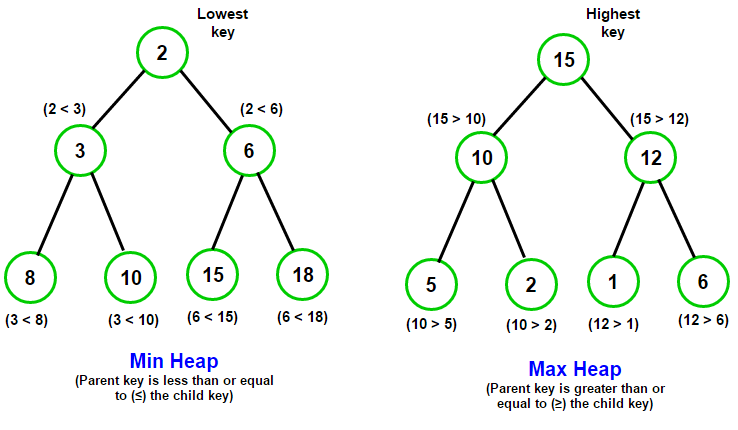

# 우선순위 큐 \( PRIORITY QUEUE \)와 힙 \( HEAP \)

## 1.우선순위 큐 \( PRIORITY QUEYE \)란?

* **들어간 순서에 상관없이 우선순위가 높은 데이터가 먼저 나온다.**
* 우선순위 큐의 이용 사례
  * 시뮬레이션 시스템
  * 네트워크 트래픽 제어
  * 운영체제에서의 작업 스케쥴링
  * 수치 해석적인 계산 
* 우선순위 큐는 배열, 연결리스트, 힙으로 구현이 가능하며 이 중에서 힙으로 구현하는 것이 가장 효율적이다.

| 우선순위 큐를 표현하는 방 | 삽입 | 삭제 |
| :---: | :---: | :---: |
| 순서 없는 배열 | O\( 1 \) | O\( n \) |
| 순서 없는 연결 리스트 | O\( 1 \) | O\( n \) |
| 정렬된 배열 | O\( n \) | O\( 1 \) |
| 정렬된 연결 리스트 | O\( n \) | O\( 1 \) |
| 힙 | O\( log n \) | O\( log n \) |

## 2. 힙 \(HEAP\) 이란?

* **힙**\(heap\)은 **최댓값** 및 **최솟값**을 찾아내는 연산을 빠르게 하기 위해 고안된 완전 이진 트리\(complete binary tree\)를 기본으로 한 자료구조\(tree-based structure\)이다. 
* '이진 트리'이되 '완전 이진 트리'이다. 그리고 모든 노드에 저장된 값은 자식 노드에 저장된 값보다 크거나 같아야 한다. 즉, 루트 노드에 저장된 값이 가장 커야 한다.

## 3. 힙 \( HEAP \)의 종

* 위 그림과 같이 루트 노드로 올라갈수록 저장된 값이 작아지는 완전 이진 트리를 가리켜 _**'최소 힙\(Min Heap\)'**_

$$
부모 노드 <= 자식 노드
$$

* 루트 노드로 올라올수록 저장된 값이 커지는 완전 이진 트리를 _**'최대 힙\(Max Heap\)'**_이라고 한다. 

$$
자식 노드 <= 부모 노드
$$

## 4. 힙\( Heap \)의 구현

* 힙을 저장하는 표준적인 자료구는 배열이다.
* 구현을 쉽게하기 위하여 배열의 첫 번째 인덱스인 0은 사용되지 않는다.
* 특정 위치의 노드 번호는 새로운 노드가 추가되어도 변하지 않는다.
  * 예를 들어, 루트 노드의 오른쪽 노드의 번호는 항상 3이다.
* 힙에서의 부모 노드와 자식 노드의 관계
  * 왼쪽 자식의 인덱스 = \( 부모의 인덱스 \) \* 2
  * 오른쪽 자식의 인덱스 = \( 부모의 인덱스 \) \* 2 + 1
  * 부모의 인덱스 = \( 자식 인덱스 \) / 2

## 5. 힙에서의 데이터 저장 과정

1. 힙에 새로운 요소가 들어오면, 일단 새로운 노드를 힙의 마지막 노드에 삽입한다.
2. 그리고 새로운 노드를 제대로 된 위치를 찾을 때까지 부모 노드들과 비교해서 위치를 바꿔준다.

## 6. 힙에서의 데이터 삭제 과정

1. 최대 힙\( Max Heap \)에서 최댓값은 루트 노드이므로 루트 노드가 삭제된다. - 최대 힙에서 삭제 연산은 최댓값을 가진 요소를 삭제하는 것이다.
2. 삭제된 루트 노드에는 힙의 마지막 노드를 가져온다.
3. 힙을 재구성한다.

