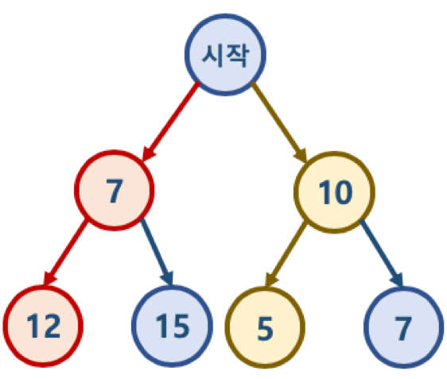

# 탐욕 알고리즘\( Greedy Algorithm \)

## 1. 탐욕 알고리즘이란?

* Greedy algorithm 또는 탐욕 알고리즘이라고 불린다.
* 최적의 해에 가까운 값을 구하기 위해 사용된다.
* 여러 경우 중 하나를 결정해야할 때마다, **매 순간 최적이라고 생각되는 경우를 선택하는 방식**으로 진행해서, 최종적인 값을 구하는 방식이다.


## 2. 탐욕 알고리즘 예

#### 문제1. 동전 문제

* 지불해야 하는 값이 4720원일 때, 1원 50원, 100원, 500원 동전으로 동전의 수가 가장 적게 지불하시오.
  * 가장 큰 동전부터 최대한 지불해야 하는 값을 채우는 방식으로 구현 가능.
  * 탐욕 알고리즘으로 매 순간 최적이라고 생각되는 경우를 선택하면 된다.

```text
def min_coin_count(value, coin_list):
    total_coin_count = 0
    details = list()
    
    coin_list.sort(reverse=True)
    
    for coin in coin_list:
        coin_num = value // coin
        total_coin_count += coin_num
        value -= coin_num * coin
        details.append([coin, coin_num])
        
    return total_coin_count, details


coin_list = [500, 100, 50, 1]
print(min_coin_count(4720, coin_list))
```


#### 문제2. 부분 배낭 문제\( Fractional Knapsack Problem \)

* 무게 제한이 k인 배낭에 최대 가치를 가지도록 물건을 넣는 문제.
  * 각 물건은 무게\( W \)와 가치\( V \)로 표현될 수 있다.
  * 물건은 쪼갤 수 있으므로 물건의 일부분이 배낭에 넣어질 수 있다. 그래서 Fractional Knapsack Problem으로 불린다.
    * Fractional Knapsack Problem의 반대로 물건을 쪼개서 넣을 수 없는 배낭 문제도 존재한다.\( 0/1 Knapsack Problem으로 불린다. \)


```text
def get_max_value(data_list, capacity):
    data_list = sorted(data_list, key = lambda x: x[1] / x[0], reverse = True)
    total_value = 0
    details = list()
    
    for data in data_list:
        if capacity - data[0] >= 0:
            capacity -= data[0]
            total_value = data[1]
            details.append([data[0], data[1], 1])
        else:
            fraction = capacity / data[0]
            total_value += data[0] + fraction
            details.append([data[0], data[1], fraction])
            break
    
    return total_value, details
    
data_list = [(10, 10), (15, 12), (20, 10), (25, 8), (30, 5)]
print(get_max_value(data_list, 30))
```


## 3. 탐욕 알고리즘의 한계

* 탐욕 알고리즘은 근사치 추정에 활용된다.
* 반드시 최적의 해를 구할 수 있는 것은 아니기 때문이다.
* 최적의 해에 가까운 값을 구하는 방법 중의 하나이다.



* '시작' 노드에서 시작해서 가장 작은 값을 찾아 leaf node까지 가는 경로를 찾을 시에
  * Greedy 알고리즘 적용시 시작 -&gt; 7 -&gt; 12를 선택하게 되므로 7 + 12 = 19가 된다,
  * 하지만 실제 가장 작은 값은 시작 -&gt; 10 -&gt; 5이며, 10 + 5 = 15가 답이다.


