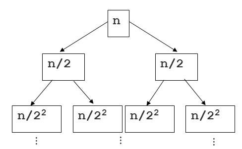

# 병합 정렬\( Merge Sort \)

## 1. 병합 정렬\( Merge Sort \)이란?

* 재귀용법을 활용한 정렬 알고리즘이다.
  * 리스트를 절반으로 잘라 비슷한 크기의 두 부분 리스트로 나눈다.
  * 각 부분 리스트를 재귀적으로 합병 정렬을 이용해 정렬한다.
  * 두 부분 리스트를 다시 하나의 정렬된 리스트로 합병한다.


## 2. 구현    

```text
def merge_split(data):
    if len(data) <= 1:
        return data
    
    medium = int(len(data) / 2)
    left = merge_split(data[:medium])
    right = merge_split(data[medium:])
    
    return merge(left, right)
    
def merge(left, right):
    merged = list()
    left_point, right_point = 0, 0
    
    # Case1: left / right 아직 남아있을 때
    while len(left) > left_point and len(right) > right:
        if left[left_point] > right[right_point]:
            merged.append(right[right_point])
            right_point += 1
        else:
            merged.append(left[left_point])
            left_point += 1
        
    
    # Case2: left만 남아있을 때
    while len(left) > left_point:
        merged.append(left[left_point])
        left_point += 1
    
    # Case3: right만 남아있을 때
    while len(right) > right_point:
        merged.append(right[right_point])
        right_point += 1
        
    return merged
```


## 3. 알고리즘 분석

* 알고리즘 분석은 쉽지 않다.
  * 다음을 보고 이해해보자.
    * 몇 단계 깊이까지 만들어지는지를 depth라고 하고 i로 놓자. 맨 위 단계는 0으로 놓자.
      * 다음 그림에서 n/2^2는 2단계 깊이라고 하자.
      * 각 단계에 있는 하나의 노드 안의 리스트 길이는 n / 2^2가 된다.
      * 각 단계에는 2^i 개의 노드가 있다.
    * 따라서, 각 단계는 항상 2^i \* n / 2^i = O\(N\)
    * 단계는 항상 log2 n개 만큼 만들어지므로 시간 복잡도는 결국 O\(log n\)
    * 따라서, 단계별 시간 복잡도는 O\(N\) \* O\(log n\) = O\(n log n\)




