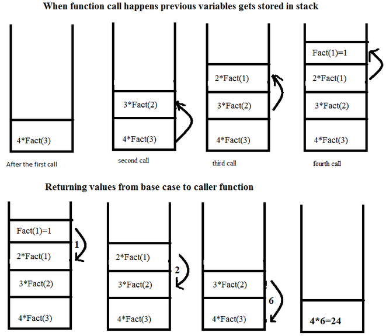

# 재귀 용법\( Recursive call, 재귀 호출  \)

## 재귀 용법\( Recursive call, 재귀 호출 \)

* 함수 안에서 동일한 함수를 호출하는 형태
* 여러 알고리즘 작성시 사용되므로 익숙해져야 한다.


## 재귀 용법 이해

#### 예제

1. 팩토리얼을 구하는 알고리즘을 재귀 용법을 활용해 알고리즘 작성하기.

* 간단한 경우부터 생각해보자
  * 2! = 1 x 2
  * 3! = 1 x 2 x 3
  * 4! = 1 x 2 x 3 x 4
* 규칙이 있음 : n! = n x \( n - 1 \)!
  * 함수를 하나 만든다.
  * 함수\(n\)은 n &gt; 1이면 return n x 함수\(n - 1\)
  * 함수\(n\)은 n = 1이면 return n
* 검증\( 코드로 검증하지 않고, 직접 간단한 경우부터 대입해서 검증해야 한다. \)
  * 먼저 2!부터
    * 함수\(2\)이면, 2 &gt; 1 이므로 2 x 함수\(1\)
    * 함수\(1\)은 1 이므로 return 2 x 1 = 2

```text
def factorial1(num):
    if num > 1:
        return num * factorial(num - 1)
    else:
        return num
        
for num in range(10):
    print(factorial1(num))
```

```text
def factorial2(num):
    if num <= 1:
        return num
        
    return num * factorial(num - 1)
        
for num in range(10):
    print(factorial2(num))
```

#### 시간 복잡도와 공간 복잡도

* factorial\(n\)은 n - 1번의 factorial\(\) 함수를 호출해서 곱셈을 한다.
  * 일종의 n - 1번 반복문을 호출한 것과 동일하다.
  * factorial\(\) 함수를 호출할 때마다 지역변수 n이 생성된다.
* 시간 복잡도 / 공간 복잡도는 O\( N - 1 \)이므로 결국 둘 다 O\(N\)이다.


## 재귀 호출의 일반적인 형태

1. 일반적인 형태1

```text
def function(입력):
    if 입력 > 일정값:                # 입력이 일정값 이상이면
        return function(입력 - 1)  # 입력보다 작은 
    else:
        reuturn 일정값              # 재귀호출 종
```

2. 일반적인 형태2

```text
def function(입력):
    if 입력 <= 일정값:            # 입력이 일정 값보다 작으면
        return 일정값 또는 입력값   # 재귀 호출 종
    
    function(입력보다 작은 값)
    
    return 결과
```


#### 재귀 호출은 스택의 전형적인 예

* 함수는 내부적으로 스택처럼 관리된다.




파이썬에서는 재귀 함수는 깊이\(한 번에 호출되는\)가 1000회 이하여야 한다.



## 연습

1. 1부터 n까지의 곱이 출력되게 만드시오.

```text
def multiple(num):
    return_value = 1
    
    for index in range(1, num + 1):
        return_value *= index
    
    return return_value
```

```text
def multiple(num):
    if num <= 1:
        return num
    
    return num * multiple(num - 1)
    
print(multiple(10))
```


2. 숫자가 들어있는 리스트가 주어졌을 때, 리스트의 합을 리턴하시오.

```text
import random

def sum(arr):
    if len(arr) == 1:
        return arr[0]
        
    return arr[0] + sum(arr[1:])


random_arr = random.sample(range(100), 10)
print(sum(random_arr))
```


3.회문\(Palindrome\)은 순서를 거꾸로 읽어도 제대로 읽은 것과 같은 단어와 문장을 의미한다. 회문을 판별 할 수 있는 함수를 리스트 슬라이싱을 활용해서 만드시오.

```text
def palindrome1(word):
    if len(word) <= 1:
        return True
    
    if string[0] == string[-1]:
        return palindrome(word[1:-1])
    else:
        return False
    

print(palindrome1(''))
```


4. 정수 n에 대해 n이 홀수이면 3 x n + 1 을 하고, n이 짝수이면 n을 2로 나눕니다. 이렇게 n이 1일 될 때까지 반복합니다.

```text
def func(n):
    print(n)
    
    if n == 1:
        return n
        
    if n % 2 == 0:
        return func(int(n / 2))
    else:
        return func(int((3 * n) + 1))
```


5. 정수 4를 1, 2, 3의 조합으로 나타내는 방법은 총 7가지 있습니다.

* 1 + 1 + 1 + 1
* 1 + 1 + 2
* 1 + 2 + 1
* 2 + 1 + 1
* 2 + 2
* 1+ 3
* 3 + 1

정수 n이 입력으로 주어졌을 때, n을 1, 2, 3의 합으로 나타낼 수 있는 방법의 수를 구하시오.


정수 n을 만들 수 있는 경우의 수를 리턴하는 함수를 f\(n\)이라고 하면, f\(n\)은 f\(n-1\) + f\(n-2\) + f\(n-3\)과 동일하다는 패턴을 찾기.


```text
def func(num):
    if num == 1:
        return 1
    elif num == 2:
        return 2
    elif num == 3:
        return 4
    
    return func(num - 1) + func(num - 2) + func(num - 3)
```


