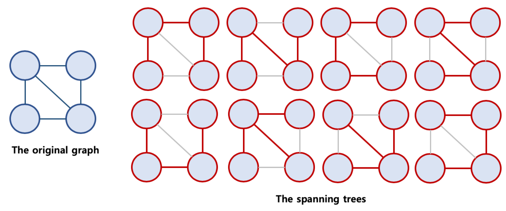
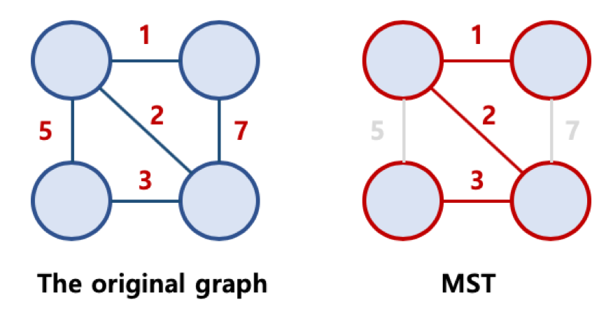
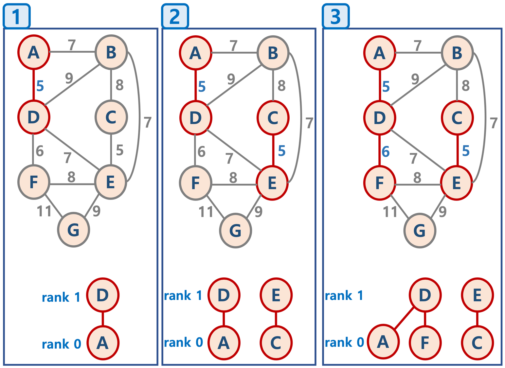
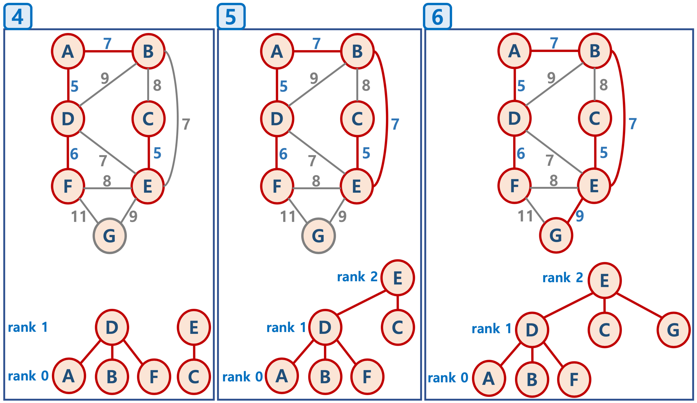
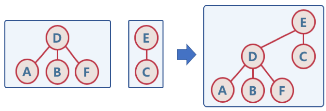
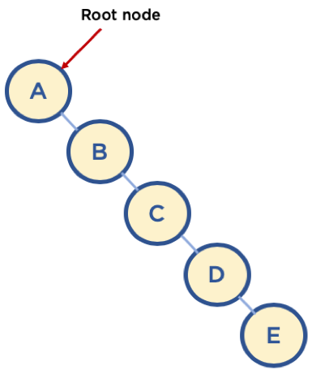
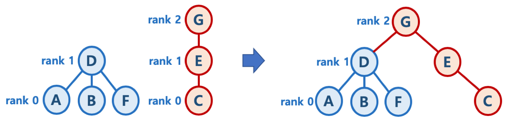
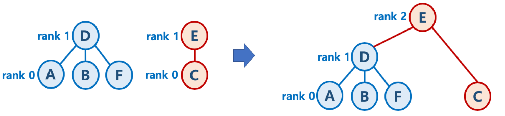
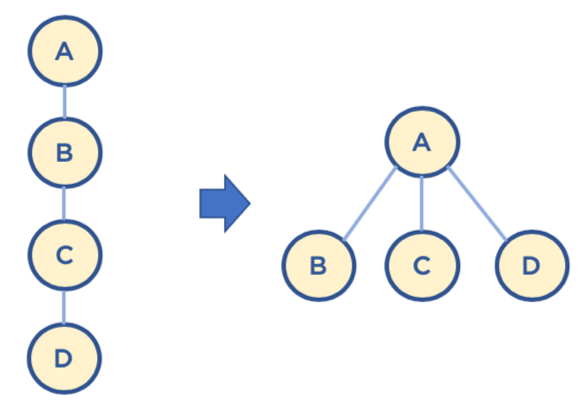
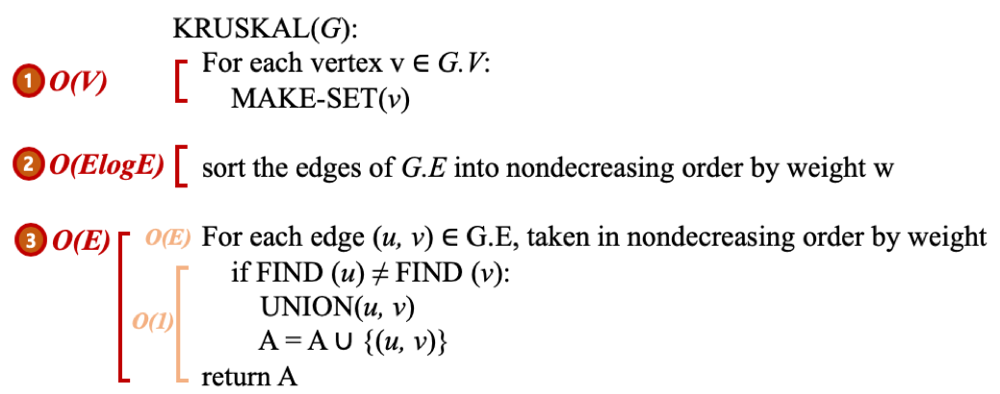

# 최소 신장 트리

## 1. 신장 트리란?

* Spanning Tree 또는 신장 트리 라고 불린다.
* 원래의 그래프의 모든 노드가 연결되어 있으면서 트리의 속성을 만족하는 그래프
* 신장 트리의 조건
  * 본래의 그래프의 모든 노드를 포함해야 한다.
  * 모든 노드가 서로 연결되어있다.
  * 트리의 속성을 만족시킨다. \( 사이클이 존재하지 않는다. \)




## 2. 최소 신장 트리

* Minimum Spanning Tree, MST 라고 불린다.
* 가능한 Spanning Tree 중에서, 간선의 가중치 합이 최소인 Spanning Tree를 지칭한다.




## 3. 최소 신장 트리 알고리즘

* 그래프에서 최소 신장 트리를 찾을 수 있는 알고리즘이 존재한다.
* 대표적인 최소 신장 트리 알고리즘
  * Kruskal's algorithm\( 크루스칼 알고리즘 \), Prim's algorithm\( 프림 알고리즘 \)


## 4. 크루스칼 알고리즘\( Kruskal's algorithm \)

1. 모든 정점을 독립적인 집합으로 만든다.
2. 모든 간선을 비용을 기준으로 정렬하고, 비용이 작은 간선부터 양 끝의 두 정점을 비교한다.
3. 두 정점의 최상위 정점을 확인하고, 서로 다를 경우 두 정점을 연결한다. \( 최소 신장 트리는 사이클이 없으므로, 사이클이 생기지 않도록 하는 것이다. \)


탐욕 알고리즘을 기초로 하고 있다.\( 당장 눈 앞의 최소 비용을 선택해서, 결과적으로 최적의 해를 찾는다. \)







## 5. Union Find 

* Disjoint Set을 표현할 때 사용하는 알고리즘으로 트리 구조를 활용하는 알고리즘
* 간단하게, 노드들 중에 연결된 노드를 찾거나, 노드들을 서로 연결할 때\( 합칠 때 \) 사용한다.
* Disjoint Set이란?
  * 서로 중복되지 않는 부분 집합들로 나눠진 원소들에 대한 정보를 저장하고 조작하는 자료구조.
  * 공통 원소가 없는\( 서로소 \) 상호 배타적인 부분 집합들로 나눠진 원소들에 대한 자료구조를 의미한다.
  * Disjoint Set = 서로소 집합 자료구조


#### 1. 초기화

* n개의 원소가 개별 집합으로 이뤄지도록 초기화


#### 2. Union

* 두 개별 집합을 하나의 집합으로 합침, 두 트리를 하나의 트리로 만든다.



#### 3. Find

* 여러 노드가 존재할 때, 두 개의 노드를 선택해서, 현재 두 노드가 서로 같은 그래프에 속하는지 판별하기 위해, 각 그룹의 최상단 원소\( 즉, 루트 노드 \)를 확인.


#### Union-Find 알고리즘의 고려할 점

* Union 순서에 따라서, 최악의 경우 링크드 리스트와 같은 형태가 될 수 있다.
* 이 때는 Find / Union 시 계산량이 O\( N \)이 될 수 있으므로, 해당 문제를 해결하기 위해, union-by-rank, path compression 기법을 사용한다.




#### Union-by-rank 기법

* 각 트리에 대해 높이\( rank \)를 기억해 두고,
* Union시 두 트리의 높이\( rank \)가 다르면, 높이가 작은 트리를 높이가 높은 트리에 붙인다. \( 즉, 높이가 큰 트리의 루트 노드가 합친 집합의 루트 노드가 되게 한다. \)



* Union시 두 트리의 높이\( rank \)가 동일하면, 높이가 h - 1인 두 개의 트리 합칠 때는 한 쪽의 트리 높이를 1 증가시켜주고, 다른 쪽의 트리를 해당 트리에 붙인다.



* 초기화시, 모든 원소는 높이\( rank \)가 0인 개별 집합인 상태에서, 하나씩 원소를 합칠 때, union-by-rank 기법을 사용한다면,
  * 높이가 h인 트리가 만들어지려면, 높이가 h - 1 인 두 개의 트리가 합쳐져야 한다.
  * 높이가 H - 1 인 트리를 만들기 위해 최소 n 개의 원소가 필요하다면, 높이가 h인 트리가 만들어지기 위해서는 최소 2n개의 원소가 필요하다.
  * 따라서, union-by-rank 기법을 사용하면, union/find 연산의 시간복잡도는 O\( N \)이 아닌 O\( log N \)으로 낮출 수 있다.


#### Path Compression 기법

* Find를 실행한 노드에서 거쳐간 노드를 루트에 다이렉트로 연결하는 기법.
* Find를 실행한 노드는 이후부터는 루트 노드를 한 번에 알 수 있다.



* union-by-rank와 path compression 기법 사용시 시간 복잡도는 다음 계산식을 만족함이 증명되었다.
  * O\( M log\* N \)
  * log\* N 은 다음 값을 가짐이 증명되었다.
    * N이 2^65536 값을 가지더라도, log\* N의 값이 5의 값을 가지므로, 거의 O\( 1 \), 즉 상수값에 가깝다고 볼 수 있다.

| N | **log\* N** |
| :---: | :---: |
| 1 | 0 |
| 2 | 1 |
| 4 | 2 |
| 16 | 3 |
| 65536 | 4 |
| 2^65536 | 5 |


## 6. 코드


```text
def ():
    
```


## 7. 시간 복잡도

* 크루스칼 알고리즘의 시간 복잡도는 O\( E log E \)
  * 다음 단계에서 2번, 간선을 비용 기준으로 정렬하는 시간에 좌우된다. \( 즉, 간선을 비용 기준으로 정렬하는 시간이 가장 크다. \)
  * 모든 정점을 독립적인 집합으로 만든다.
  * 모든 간선을 비용을 기준으로 정렬하고, 비용이 작은 간선부터 양 끝의 두 정점을 비교한다.
    * 퀵소느를 사용한다면 시간 복잡도는 O\( N log N \)이며, 간선이 n 이므로 O\( E log E \)이다.
  * 두 정점의 최상위 정점을 확인하고, 서로 다를 경우 두 정점을 연결한다. \( 최소 신장 트리는 사이클이 없으므로, 사이클이 생기지 않도록 하는 것이다. \)
    * union-by-rank와 path compression 기법 사용시 시간 복잡도가 결국 상수값에 가깝다. O\( 1 \)




