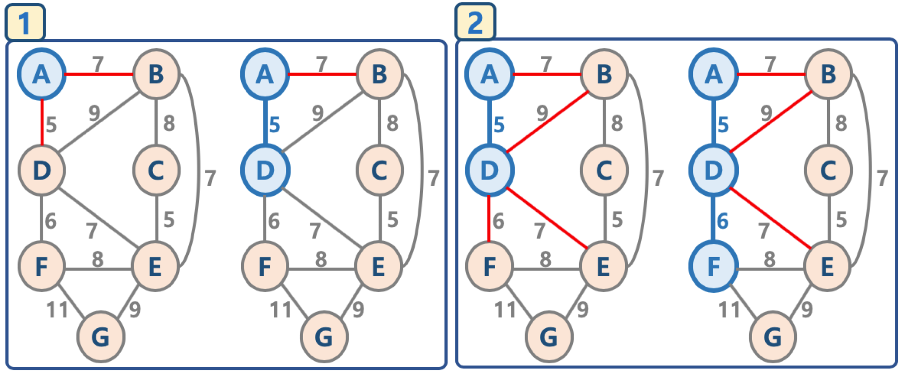
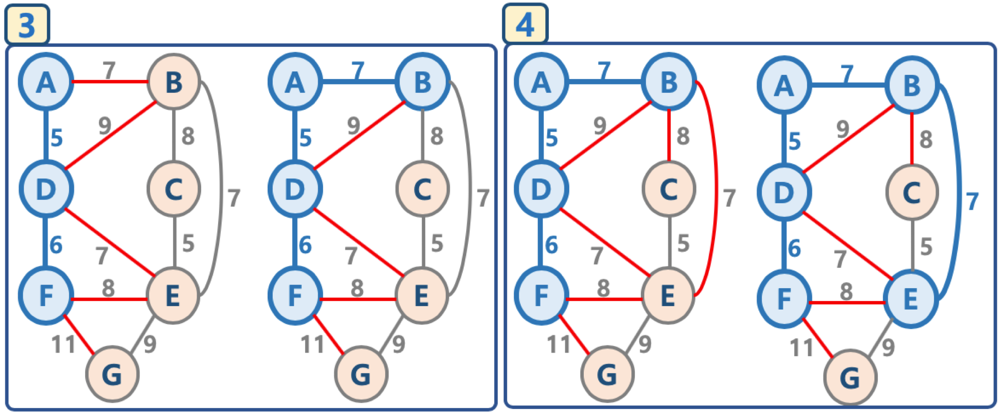
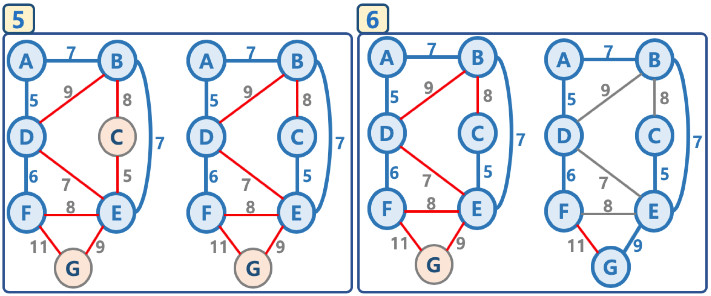

# 최소 신장 트리

## 1. 신장 트리란?

* Spanning Tree 또는 신장 트리 라고 불린다.
* 원래의 그래프의 모든 노드가 연결되어 있으면서 트리의 속성을 만족하는 그래프
* 신장 트리의 조건
  * 본래의 그래프의 모든 노드를 포함해야 한다.
  * 모든 노드가 서로 연결되어있다.
  * 트리의 속성을 만족시킨다. \( 사이클이 존재하지 않는다. \)


## 2. 최소 신장 트리

* Minimum Spanning Tree, MST 라고 불린다.
* 가능한 Spanning Tree 중에서, 간선의 가중치 합이 최소인 Spanning Tree를 지칭한다.


## 3. 최소 신장 트리 알고리즘

* 그래프에서 최소 신장 트리를 찾을 수 있는 알고리즘이 존재한다.
* 대표적인 최소 신장 트리 알고리즘
  * Kruskal's algorithm\( 크루스칼 알고리즘 \), Prim's algorithm\( 프림 알고리즘 \)


## 4. 크루스칼 알고리즘\( Kruskal's Algorithm \)

1. 모든 정점을 독립적인 집합으로 만든다.
2. 모든 간선을 비용을 기준으로 정렬하고, 비용이 작은 간선부터 양 끝의 두 정점을 비교한다.
3. 두 정점의 최상위 정점을 확인하고, 서로 다를 경우 두 정점을 연결한다. \( 최소 신장 트리는 사이클이 없으므로, 사이클이 생기지 않도록 하는 것이다. \)


탐욕 알고리즘을 기초로 하고 있다.\( 당장 눈 앞의 최소 비용을 선택해서, 결과적으로 최적의 해를 찾는다. \)



## 5. Union Find 

* Disjoint Set을 표현할 때 사용하는 알고리즘으로 트리 구조를 활용하는 알고리즘
* 간단하게, 노드들 중에 연결된 노드를 찾거나, 노드들을 서로 연결할 때\( 합칠 때 \) 사용한다.
* Disjoint Set이란?
  * 서로 중복되지 않는 부분 집합들로 나눠진 원소들에 대한 정보를 저장하고 조작하는 자료구조.
  * 공통 원소가 없는\( 서로소 \) 상호 배타적인 부분 집합들로 나눠진 원소들에 대한 자료구조를 의미한다.
  * Disjoint Set = 서로소 집합 자료구조


#### 1. 초기화

* n개의 원소가 개별 집합으로 이뤄지도록 초기화


#### 2. Union

* 두 개별 집합을 하나의 집합으로 합침, 두 트리를 하나의 트리로 만든다.


#### 3. Find

* 여러 노드가 존재할 때, 두 개의 노드를 선택해서, 현재 두 노드가 서로 같은 그래프에 속하는지 판별하기 위해, 각 그룹의 최상단 원소\( 즉, 루트 노드 \)를 확인.


#### Union-Find 알고리즘의 고려할 점

* Union 순서에 따라서, 최악의 경우 링크드 리스트와 같은 형태가 될 수 있다.
* 이 때는 Find / Union 시 계산량이 O\( N \)이 될 수 있으므로, 해당 문제를 해결하기 위해, union-by-rank, path compression 기법을 사용한다.


#### Union-by-rank 기법

* 각 트리에 대해 높이\( rank \)를 기억해 두고,
* Union시 두 트리의 높이\( rank \)가 다르면, 높이가 작은 트리를 높이가 높은 트리에 붙인다. \( 즉, 높이가 큰 트리의 루트 노드가 합친 집합의 루트 노드가 되게 한다. \)


* Union시 두 트리의 높이\( rank \)가 동일하면, 높이가 h - 1인 두 개의 트리 합칠 때는 한 쪽의 트리 높이를 1 증가시켜주고, 다른 쪽의 트리를 해당 트리에 붙인다.


* 초기화시, 모든 원소는 높이\( rank \)가 0인 개별 집합인 상태에서, 하나씩 원소를 합칠 때, union-by-rank 기법을 사용한다면,
  * 높이가 h인 트리가 만들어지려면, 높이가 h - 1 인 두 개의 트리가 합쳐져야 한다.
  * 높이가 H - 1 인 트리를 만들기 위해 최소 n 개의 원소가 필요하다면, 높이가 h인 트리가 만들어지기 위해서는 최소 2n개의 원소가 필요하다.
  * 따라서, union-by-rank 기법을 사용하면, union/find 연산의 시간복잡도는 O\( N \)이 아닌 O\( log N \)으로 낮출 수 있다.


#### Path Compression 기법

* Find를 실행한 노드에서 거쳐간 노드를 루트에 다이렉트로 연결하는 기법.
* Find를 실행한 노드는 이후부터는 루트 노드를 한 번에 알 수 있다.


* union-by-rank와 path compression 기법 사용시 시간 복잡도는 다음 계산식을 만족함이 증명되었다.
  * O\( M log\* N \)
  * log\* N 은 다음 값을 가짐이 증명되었다.
    * N이 2^65536 값을 가지더라도, log\* N의 값이 5의 값을 가지므로, 거의 O\( 1 \), 즉 상수값에 가깝다고 볼 수 있다.

| N | **log\* N** |
| :---: | :---: |
| 1 | 0 |
| 2 | 1 |
| 4 | 2 |
| 16 | 3 |
| 65536 | 4 |
| 2^65536 | 5 |


## 6. 크루스칼 알고리즘 코드

```text
# 각각 노드의 부모노드를 저장
parent = dict()
    
# 각 노드마다의 rank
rank = dict()

def make_set(node):
    partnet[node] = node
    rank[node] = 0
    
    
def find(node):
    # path compression
    if parent[node] != node:
        parent[node] = find(parent[node])
        
    return parent[node]
    

def union(node_v, node_u):
    root1 = find(node_v)
    root2 = find(node_u)
    
    # union-by-rank 기법
    if rank[root1] > rank[root2]:
        parent[root2] = root1
    else:
        parent[root1] = root2
        
        if rank[root1] == rank[root2]:
            rank[root2] += 1


def kruskal(graph):    
    mst = list()
    
    # 1. 초기화    
    for node in graph['vertices']:
        make_set(node)
    
    # 2. 간선 weight 기반 sorting    
    edges = graph['edges']
    edges.sort()
    
    # 3. 간선 연결( 사이클 없는 )
    for edge in edges:
        weight, node_v, node_u = edge
        
        if find(node_v) != find(node_u):
            union(node_v, node_u)
            mst.append(edge)
    
    return mst
    
graph = {
    'vertices': ['A', 'B', 'C', 'D', 'E', 'F', 'G'],
    'edges': [
        (7, 'A', 'B'),
        (5, 'A', 'D'),
        (7, 'B', 'A'),
        (8, 'B', 'C'),
        (9, 'B', 'D'),
        (7, 'B', 'E'),
        (8, 'C', 'B'),
        (5, 'C', 'E'),
        (5, 'D', 'A'),
        (9, 'D', 'B'),
        (7, 'D', 'E'),
        (6, 'D', 'F'),
        (7, 'E', 'B'),
        (5, 'E', 'C'),
        (7, 'E', 'D'),
        (8, 'E', 'F'),
        (9, 'E', 'G'),
        (6, 'F', 'D'),
        (8, 'F', 'E'),
        (11, 'F', 'G'),
        (9, 'G', 'E'),
        (11, 'G', 'F'),
    ]
}

print(kruskal(graph))
```


## 7. 시간 복잡도

* 크루스칼 알고리즘의 시간 복잡도는 O\( E log E \)
  * 다음 단계에서 2번, 간선을 비용 기준으로 정렬하는 시간에 좌우된다. \( 즉, 간선을 비용 기준으로 정렬하는 시간이 가장 크다. \)
  * 모든 정점을 독립적인 집합으로 만든다.
  * 모든 간선을 비용을 기준으로 정렬하고, 비용이 작은 간선부터 양 끝의 두 정점을 비교한다.
    * 퀵소느를 사용한다면 시간 복잡도는 O\( N log N \)이며, 간선이 n 이므로 O\( E log E \)이다.
  * 두 정점의 최상위 정점을 확인하고, 서로 다를 경우 두 정점을 연결한다. \( 최소 신장 트리는 사이클이 없으므로, 사이클이 생기지 않도록 하는 것이다. \)
    * union-by-rank와 path compression 기법 사용시 시간 복잡도가 결국 상수값에 가깝다. O\( 1 \)


## 8. 프림 알고리즘\( Prim's Algorithm \)

* 대표적인 최소 신장 트리 알고리즘
  * Kruskal's algorithm\( 크루스칼 알고리즘 \), Prim's algorithm\( 프림 알고리즘 \) 
* 프림 알고리즘
  * 시작 정점을 선택한 후, 정점에 인접한 간선중 최소 간선으로 연결된 정점을 선택하고, 해당 정점에서 다시 최소 간선으로 연결된 정점을 선택하는 방식으로 최소 신장 트리를 확장해가는 방식. 
* 크루스칼 알고리즘과 프리 알고리즘 비교
  * 둘 다 탐욕 알고리즘을 기초로 하고 있다.\( 당장 눈 앞의 최소 비용을 선택해서, 결과적으로 최적의 솔루션을 찾는다. \)
    * 크루스칼 알고리즘은 가중치가 작은 간선부터 선택하면서 MST를 구한다.
    * 프림 알고리즘은 특정 정점에서 시작, 해당 정점에 연결된 가장 가중치가 작은 간선을 선택, 간선으로 연결된 정점들에 연결된 간선 중에서 가장 가중치가 작은 간선을 택하는 방식으로 MST를 구한다.


## 9. 그림으로 이해하는 프림 알고리즘

1. 임의의 정점을 선택, '연결된 노드 집합'에 삽입.
2. 선택된 정점에 연결된 간선들을 간선 리스트에 삽입.
3. 간선 리스트에서 최소 가중치를 가지는 간선부터 추출해서,
   1. 해당 간선에 연결된 인접 정점이 '연결된 노드 집합'에 이미 들어 있다면, 스킵한다.\( Cycle 발생을 막기 위함 \)
   2. 해당 간선에 연결된 인접 정점이 '연결된 노드 집합'에 들어 있지 않으면, 해당 간선을 선택하고, 해당 간선 정보를 '최소 신장 트리'에 삽입
4. 추출한 간선은 간선 리스트에서 제거.
5. 간선 리스트에 더 이상의 간선이 없을 때까지 3 - 4번을 반복.








## 10. 프림 알고리즘 코드


참고! heapq 라이브러리 활용을 통해 우선순위 큐 사용하기



참고! collections 라이브러리의 defaultdict 함수 활용하기.


```text
from collections import defaultdict

list_dict = defaultdict(list)
print(list_dict['key1']) # []

list dict2 = dict()
print(list_dict2['key1']) # 에
```


1. 모든 간선 정보를 저장\( adjacent\_edges \)
2. 임의의 정점을 선택하고 '연결된 노드 집합\( connected\_nodes \)'에 삽입.
3. 선택된 정점에 연결된 간선들을 간선 리스트\( candidate\_edge\_list \)에 삽입.
4. 간선 리스트\( candidate\_edge\_list \)에서 최소 가중치를 가지는 간선부터 추출해서,
   1. 해당 간선에 연결된 인접 정점이 '연결된 노드 집합'에 이미 들어 있다면, 스킵한다.\( Cycle 발생을 막기 위해 \)
   2. 해당 간선에 연결된 인접 정점이 '연결된 노드 집합'에 들어 있지 않다면, 해당 간선을 선택하고, 해당 간선 정보를 '최소 신장 트리\( mst \)'에 삽입한다.
      1. 해당 간선에 연결된 인접 정점의 간선들 중, '연결된 노드 집합\( connected\_nodes \)'에 없는 노드와 연결된 간선들만 간선 리스트\( candidate\_edge\_list \)에 삽입한다.
         1. '연결된 노드 집합\( connected\_nodes \)'에 있는 노드와 연결된 간선들을 간선 리스트에 삽입해도, 해당 간선은 스킵될 것이기 때문이다.
         2. 어차피 스킵될 간선을 간선 리스트\( candidate\_edge\_list \)에 넣지 않으므로 해서, 간선 리스트\( candidate\_edge\_list \)에서 최소 가중치를 가지는 간선부터 추출하기 위한 자료구조 유지를 위한 effort를 줄일 수 있다. \( 예, 최소힙 구조 사용 \) 
5. 선택된 간선은 간선 리스트에서 제거한다.
6. 간선 리스트에 더 이상의 간선이 없을 때까지 3 - 4 번을 반복한다.


```text
from collections import defaultdict
from heapq import *

def prim(start_node, edges):
        mst = list()
        adjacent_edges = defaultdict(list)
        
        for weight, node1, node2 in edges:
                adjacent_edges[node1].append((weight, node1, node2))
                adjacent_edges[node2].append((weight, node2, node1))
        
        connected_nodes = set(start_node)
        candidate_edge_list = adjacent_edges[start_node]
        heapify(candidate_edge_list)
        
        while candidate_edge_list:
                weight, node1, node2 = heappop(candidate_edge_list)
                
                if node2 not in connected_nodes:
                        connected_nodes.add(node2)
                        mst.append((weight, node1, node2))
                        
                        for edge in adjacent_edges[node2]:
                                if edge[2] not in connected_nodes:
                                        heappush(candidate_edge_list, edge)
        
        return mst
        

edges = [
        (7, 'A', 'B'),
        (5, 'A', 'D'),
        (8, 'B', 'C'),
        (9, 'B', 'D'),
        (7, 'B', 'E'),
        (5, 'C', 'E'),
        (7, 'D', 'E'),
        (6, 'D', 'F'),
        (8, 'E', 'F'),
        (9, 'E', 'G'),
        (11, 'F', 'G'),    
]

print(prim('A', edges))
```


#### 개선된 프림 알고리즘

* 간선이 아닌 노드를 중심으로 우선순위 큐를 적용하는 방식.
  * 초기화 - 정점 : key 구조를 만들어 놓고, 특정 정점의 key값은 0, 이외의 정점들의 key값은 무한대로 놓는다.        모든 정점: key 값은 우선순위 큐에 넣는다. 
  * 가장 key 값이 적은 정점 : key를 추출한 후\( pop하므로 해당 정점 : key 정보는 우선순위 큐에서 삭제됨 \), \( extract min 로직이라고 부른다. \) 
  * 해당 정점의 인접한 정점들에 대해 key 값과 연결된 가중치 값을 비교하여 key 값이 작으면 해당 정점: key 값을 갱신한다.
    * 정점 : key 값 갱신시, 우선순위 큐는 최소 key 값을 가지는 정점 : key를 루트노드로 올려놓도록 재구성한다.\( decrease key 로직이라고 부른다. 
* 개선된 프림 알고리즘 구현시 고려 사항
  * 우선순위 큐\(최소힙\) 구조에서, 이미 들어가 있는 데이터의 값 변경시, 최소값을 가지는 데이터를 루트노드로 올려놓도록 재구성하는 기능이 필요하다.
  * 구현 복잡도를 줄이기 위해 heapdict 라이브러리를 통해 해당 기능을 간단히 구현할 수 있다.

```text
from heapdict import heapdict

def prim(graph, start):
    mst, keys, pi, total_weight = list(), heapdict(), dict(), 0
    
    for node in graph.keys():
        keys[node] = float('inf')
        pi[node] = None
    
    keys[start], pi[start] = (), start
    
    while keys:
        current_node, current_key = keys.popitem()
        mst.append([pi[current_node], current_node, current_key])
        total_weight += current_key
        
        for adjacent, weight in graph[current_node].items()
            if adjacent in keys and weight < keys[adjacent]:
                keys[adjacent] = weight
                pi[adjacent] = current_node
    
    return mst, total_weight
```


## 11. 시간 복잡도

* **크루스칼 알고리즘** 
  * 최악의 경우, while 구문에서 모든 간선에 대해 반복하고, 최소 힙 구조를 사용하므로 O\( E log E \) 시간 복잡도를 가진다. 
* **프림 알고리즘**
  * 최초 Key 생성 시간 복잡도 : O\( V \) 
  * while 구문과 keys.popitem\(\) 의 시간 복잡도는 O\( V log V \)
    * while 구문은 V\( 노드 갯수 \)번 실행된다.
    * heap에서 최소 key 값을 가지는 노드 정보 추출 시\( pop \)의 시간 복잡도 : O\( log V \) 
  * for 구문의 총 시간 복잡도는 O\( E log V \)
    * for 구문은 while 구문 반복시에 결과적으로 총 최대 간선의 수 E만큼 실행 가능하다. O\( E \)
    * for 구문 안에서 key 값 변경시마다 heap 구조를 변경해야 하며, heap에는 최대 V개의 정보가 있으므로 O\( log V \)이다. 
  * 따라서, 총 시간 복잡도는 O\( V + V log V + E log V \)이며,
    * O\( V \)는 전체 시간 복잡도에 큰 영향을 미치지 않으므로 삭제,
    * E &gt; V 이므로 \( 최대 V^2 = E 가 될 수 있다. \), O\( \( V + E \)log V \)는 간단하게 O\( E log V \)로 나타낼 수 있다.


