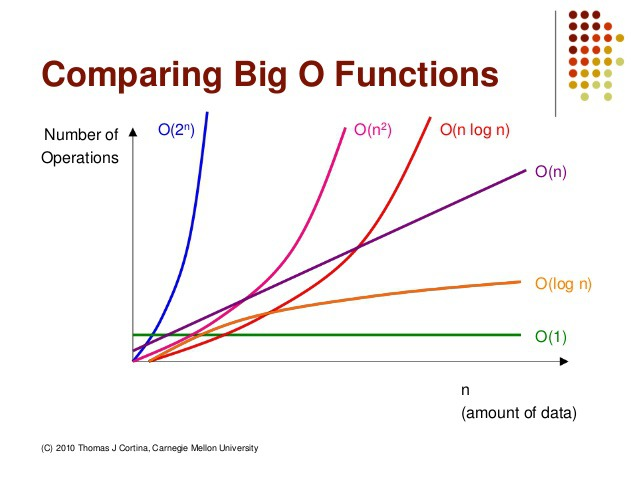

# 알고리즘 복잡도 표현 방법

## 1. 알고리즘 복잡도 계산이 필요한 이유

#### 하나의 문제를 푸는 알고리즘은 다양할 수 있다.

* 정수의 절대값 구하기
  * 방법1 : 정수값을 제곱한 값에 다시 루트를 씌우기
  * 방법2 : 정수가 음수인지 확인해서 음수일 때만 -1을 곱하기


다양한 알고리즘 중 어느 알고리즘이 더 좋은지를 분석하기 위해 복잡도를 정의하고 계산한다.



## 2. 알고리즘 복잡도 계산 항목

1. **시간 복잡도 :** 알고리즘 실행 속도
2. **공간 복잡도 :** 알고리즘이 사용하는 메모리 사이


가장 중요한 시간 복잡도를 꼭 이해하고 계산할 수 있어야 한다.



## 3. 알고리즘 시간 복잡도의 주요 요소


반복문이 지배합니다.


#### 마찬가지로, 프로그래밍에서 시간 복잡도에 가장 영향을 많이 미치는 요소는 반복문이다.

* 입력의 크기가 커지면 커질수록 반복문이 알고리즘 수행 시간을 지배한다.


## 4. 알고리즘 성능 표기법

* Big O \(빅-오\) 표기법: O\(N\)
  * 알고리즘 최악의 실행 시간을 표기한다.
  * 가장 많이 / 일반적으로 사용한다.
  * 아무리 최악의 상황이라도 이 정도의 성능은 보장한다는 의미이기 때문이다. 
* Ω \(오메가\) 표기법 : Ω\(N\)
  * 오메가 표기법은 알고리즘 최상의 실행 시간을 표기한다. 
* Θ \(세타\) 표기법 : Θ\(N\)
  * 세타 표기법은 알고리즘 평균 실행 시간을 표기한다.


시간 복잡도 계산은 반복문이 핵심 요소임을 인지하고, 계산 표기는 최상, 평균, 최악 중 최악의 시간인 Big-O 표기법을 중심으로 익히면 된다.



## 5. Big O 표기법

* 빅 오 표기법, Big-O 표기법이라고도 부른다.
* O\(입력\)
  * 입력 n에 따라 결정되는 시간 복잡도 함수
  * O\(1\), O\(log n\), O\(n\), O\(nlog n\), O\(n^2\), O\(2^n\), O\(n!\) 등으로 표기한다.
  * 입력 n의 크기에 따라 기하급수적으로 시간 복잡도가 늘어날 수 있다.
    * O\(1\) &lt; O\(log n\) &lt; O\(n\) &lt; O\(nlog n\) &lt; O\(n\*\*2\) &lt; O\(2\*\*n\) &lt; O\(n!\)
      * 참고, log n의 베이스는 2 - log2n 
* 단순하게 입력 n에 따라 몇 번 실행이 되는지를 계산하면 됩니다.
  * 표현식에 가장 큰 영향을 미치는 n의 단위로 표기합니다.
  * n이 1이든 100이든, 1000이든 실행을
    * 무조건 2회\(상수회\) 실행한다 : O\(1\)
    * n에 따라, n번, n + 10번 또는 3n + 10번 등 실행한다 : O\(n\)
    * n에 따라, n^2번, n^2 + 1000번 또는 100n^2 - 100번 등 실행한다 : O\(n^2\)



* 빅 오 입력값 표기 방법
  * e.g.\)
    * 만약, 시간 복잡도 함수가 2n^2 + 3n 이라면
      * 가장 높은 차수는 2n^2
      * 상수는 실제 큰 영향이 없음
      * 결국 빅 오 표기법으로는 **O\(n^2\)** 


## 6. 실제 알고리즘을 예로 각 알고리즘의 시간 복잡도와 빅 오 표기법 알아보기

### 1. 1부터 n까지의 합을 구하는 알고리즘1

* 합을 기록할 변수를 만들고 0을 저장
* n을 1부터 1씩 증가하면서 반복
* 반복문 안에서 합을 기록할 변수에 1씩 증가된 값을 더함
* 반복이 끝나면 합을 출력

```text
def sum_all(n):
    total = 0
    
    for num in range(1, n + 1):
        total += num
    
    return total
    
sum_all(100) // 5050
```

#### 시간 복잡도 구하기

* 1부터 n까지의 합을 구하는 알고리즘1
  * 입력 n에 따라 덧셈을 n번 해야 한다. \(for 반복문\)
  * 시간 복잡도 : n / Big-O : O\(n\)


### 2. 1부터 n까지의 합을 구하는 알고리즘2

* n\( n + 1\) / 2

```text
def sum_all(n):
    return int(n * (n + 1) / 2)
    
sum_all(100) // 5050
```

#### 시간 복잡도 구하기

* 1부터 n까지의 합을 구하는 알고리즘2
  * 입력 n이 어떻든 간에 덧셈/곱셈/나눗셈 하면 된다. \( 반복문 X \)
  * 시간 복잡도 : 1 / Big-O : O\(1\)


